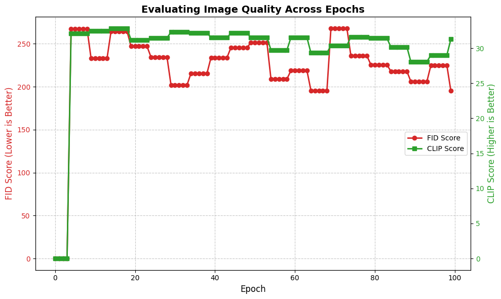

# NhatBinh-LoRA: Sinh ảnh Cổ phục Việt Nam với Stable Diffusion

Dự án ứng dụng Trí tuệ Nhân tạo Tạo sinh (Generative AI) để bảo tồn và phục dựng hình ảnh Áo Nhật Bình truyền thống của Việt Nam. Sử dụng mô hình Stable Diffusion v1.5 kết hợp với kỹ thuật Low-Rank Adaptation (LoRA), hệ thống giải quyết triệt để hiện tượng "Ảo giác AI" (lai tạp văn hóa với Kimono, Hanbok) khi sinh ảnh bằng văn bản.

## Điểm nổi bật của dự án

- **Tự động hóa dữ liệu (Data Pipeline):** Tích hợp mô hình BLIP để Auto-captioning. Sử dụng Biểu thức chính quy (Regex) để loại bỏ thiên kiến văn hóa từ dữ liệu văn bản và tiêm từ khóa kích hoạt (`nhatbinh dress`).
- **Huấn luyện tối ưu (Training Pipeline):** Xây dựng luồng huấn luyện chuẩn OOP, hỗ trợ phân tán đa GPU (Distributed Data Parallel) qua `accelerate`. Tối ưu VRAM bằng Mixed Precision (FP16) và Gradient Accumulation.
- **Suy luận tốc độ cao (Inference Pipeline):** Áp dụng kỹ thuật Dung hợp trọng số (Merge and Unload) đưa LoRA trực tiếp vào U-Net gốc, loại bỏ hoàn toàn độ trễ và lỗi bất đồng bộ. Cung cấp giao diện tương tác Web qua Gradio.
- **Hiệu năng hội tụ:** Mô hình đạt cấu trúc ảnh chuẩn xác tại Epoch 100 với chỉ số đánh giá ấn tượng: **FID = 195.09** và **CLIP Score = 31.29**.

## Kiến trúc hệ thống

Dự án tuân thủ nguyên lý Single Responsibility Principle (SRP) với 3 module cốt lõi:

1. `CustomLoRADataset`: Xử lý I/O ảnh, chuẩn hóa không gian màu và mã hóa văn bản (CLIP Tokenizer).
2. `Trainer` & `Evaluator`: Điều phối huấn luyện, tính toán tự động hàm Loss, FID và CLIP Score. Cơ chế phục hồi trạng thái (State Restoration) tự động dọn dẹp VRAM và ép kiểu FP32 sau đánh giá.
3. `NhatBinhInference`: Engine suy luận tích hợp Gradio Web UI.

## Cài đặt môi trường

Yêu cầu hệ thống: Python 3.10+ và GPU hỗ trợ CUDA (Khuyến nghị NVIDIA T4/RTX 3060 trở lên).

```bash
# Clone repository
git clone [https://github.com/your-username/NhatBinh-LoRA.git](https://github.com/your-username/NhatBinh-LoRA.git)
cd NhatBinh-LoRA

# Tạo môi trường ảo (tùy chọn nhưng khuyến nghị)
python -m venv venv
source venv/bin/activate  # Trên Windows dùng: venv\Scripts\activate

# Cài đặt các thư viện phụ thuộc
pip install -r requirements.txt
```

## Hướng dẫn sử dụng

### 1. Huấn luyện mô hình (Training)

Để bắt đầu quá trình huấn luyện từ đầu với tập dữ liệu của bạn, sử dụng lệnh sau (hỗ trợ tự động nhận diện đa GPU qua accelerate):

```bash
accelerate launch train.py \
  --pretrained_model_name_or_path="runwayml/stable-diffusion-v1-5" \
  --dataset_dir="./data" \
  --output_dir="./lora_nhatbinh_weights" \
  --resolution=512 \
  --train_batch_size=16 \
  --num_train_epochs=100 \
  --learning_rate=1e-4 \
  --mixed_precision="fp16"
```

### 2. Chạy giao diện Web (Inference)

Để khởi chạy giao diện tương tác Gradio và sinh ảnh theo thời gian thực:

```bash
python app.py --model_path "runwayml/stable-diffusion-v1-5" --lora_path "./lora_nhatbinh_weights"
```

Một số Prompt (câu lệnh) mẫu để thử nghiệm:

- nhatbinh dress, a woman standing in an ancient garden

- nhatbinh dress, high quality, traditional attire

- nhatbinh dress, portrait of a royal woman

### Kết quả thực nghiệm




Chất lượng hình ảnh tiến hóa rõ rệt qua các mốc huấn luyện, từ hiện tượng mờ nhòe, lai tạp ở Epoch 10 cho đến mức độ chân thực (photorealistic), chuẩn form dáng đối khâm và họa tiết dạng ổ tại Epoch 100.


| Chỉ số đánh giá | Giá trị (Epoch 100) | Ý nghĩa                                                                   |
| :-------------- | :------------------ | :------------------------------------------------------------------------ |
| **FID**         | 195.09              | Phân phối của ảnh sinh ra tiệm cận rất sát với ảnh thật. Độ sắc nét cao.  |
| **CLIP Score**  | 31.29               | Hình ảnh bám sát tuyệt đối câu lệnh điều kiện, không bị sai lệch văn hóa. |
